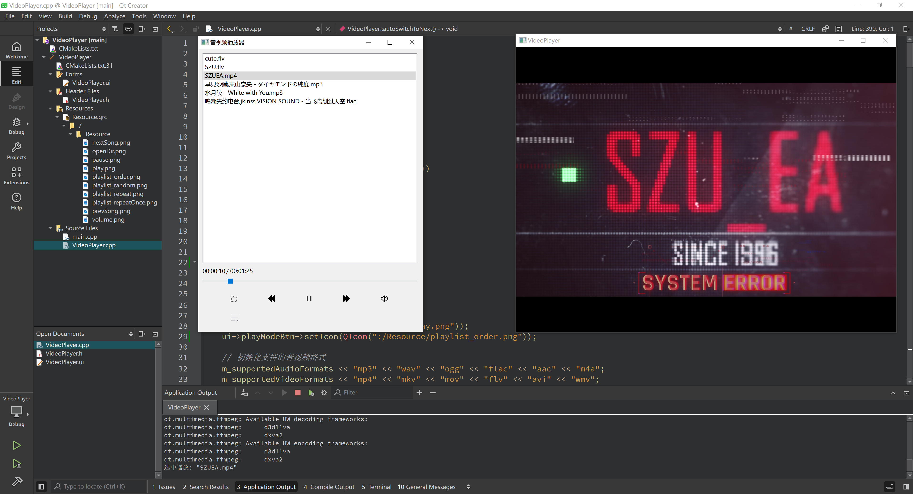

  <a href="README_en.md">English</a>

## 基于 Qt 6.8.2 开发的简易音视频播放器

License MIT
C++ 17
Platform Windows

`Qt_VideoPlayer` 是一款基于 Qt 6.8.2、C++17 开发的简易音视频播放器，目前仅成功适用于 Qt Creator 环境运行。它旨在提供简洁易用的图形界面，同时展示 Qt 框架与多媒体处理库的结合实践，实际运行界面如下：

> *注意：本项目主要用于个人学习 Qt 多媒体开发的设计思路分享，而非打造一个功能完备、可以替代 VLC 或 PotPlayer 等成熟产品的日常播放器。*

项目介绍详细教学文档：https://zhuanlan.zhihu.com/p/1929289732564710634

## 功能特性

- 功能 1：实现基本播放器 UI 布局和规范化命名。
- 功能 2：读取本地文件夹媒体文件到播放器列表，双击播放音频或视频，支持常见音视频格式播放。
- 功能 3：逻辑自动识别当前播放媒体是音频还是视频，播放音频时默认隐藏视频播放窗口，仅当播放视频时显示窗口并将当前播放媒体渲染输出到窗口显示播放。
- 功能 4：实现按钮切换逻辑，即播放完自动切下一项、上下曲按钮交互、当前播放项目列表高亮跟踪等。
- 功能 5：丰富按钮控制逻辑，即控制媒体播放暂停、音量大小调节、以及拖动进度条和时长显示。
- 功能 6：自定义窗口关闭事件，当关闭正在播放的视频窗口时，播放按钮、音频以及进度条和时间标签同步暂停，再次点击播放按钮或是双击列表视频文件时会重新显示，确保视频窗口随播放操作同步显现。

## 计划功能

本项目会继续完善更新更多新功能与 UI 交互，各项计划功能的优先度顺序如下：
- 新按钮交互：新添自动播放结束后的切换逻辑为三种，单曲循环、顺序播放、随机播放，可通过点击按钮切换模式。
- 可变速播放：主要针对视频文件，可实现 0.5、2 倍速等变速播放视频，同时进度条和时间标签也是随变速而变化。

## 联系咨询

本项目的更详细分析或疑问咨询详见笔者知乎博客 https://www.zhihu.com/people/13-73-62-89-19
本人邮箱：2022280099@email.szu.edu.cn 欢迎提 issue 分享修改完善建议！

感谢你的关注与青睐！

