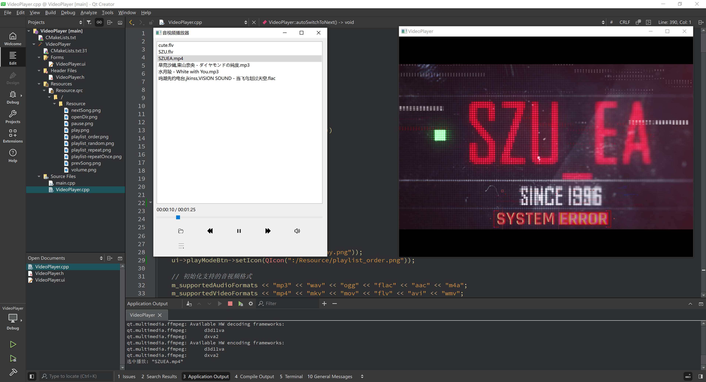

  <a href="README_en.md">English</a>

# 🎬 基于 Qt 6.8.2 开发的简易音视频播放器

  <!-- 增加一个空行间距 -->

  <strong>Qt_6.8.2</strong>&nbsp;&nbsp;&nbsp;&nbsp;&nbsp;&nbsp;
  <strong>C++ 17</strong>&nbsp;&nbsp;&nbsp;&nbsp;&nbsp;&nbsp;
  <strong>Platform Windows</strong>

  <!-- 再增加一个空行间距，让徽章与正文分开 -->

`Qt_VideoPlayer` 是一款基于 Qt 6.8.2、C++17 开发的简易音视频播放器，目前成功适用于 Qt Creator 环境运行。它旨在提供简洁易用的图形界面，同时展示 Qt 框架与多媒体处理库的结合实践，实际运行界面如下：

> *注意：本项目主要用于个人学习 Qt 多媒体开发的设计思路分享，而非打造一个功能完备、可以替代 VLC 或 PotPlayer 等成熟产品的日常播放器。*

项目介绍详细教学文档：https://zhuanlan.zhihu.com/p/1929289732564710634

## 功能特性

- 功能 1：实现基本播放器 UI 布局和规范化命名。
- 功能 2：读取本地文件夹媒体文件到播放器列表，双击播放音频或视频，支持常见音视频格式播放。
- 功能 3：逻辑自动识别当前播放媒体是音频还是视频，播放音频时默认隐藏视频播放窗口，仅当播放视频时显示窗口并将当前播放媒体渲染输出到窗口显示播放。
- 功能 4：实现按钮切换逻辑，即播放完自动切换（点击可选单曲循环、顺序播放、随机播放三种模式）、上下曲切换按钮交互、当前播放项目列表高亮跟踪等。
- 功能 5：丰富按钮控制逻辑，即控制媒体播放暂停、音量大小调节、拖动进度条改变播放位置、以及媒体总时长与当前播放进度位置显示。
- 功能 6：自定义窗口关闭事件，当关闭正在播放的视频窗口时，播放按钮、音频以及进度条和时间标签同步暂停，再次点击播放按钮或是双击列表视频文件时会重新显示，确保视频窗口随播放操作同步显现。

## 核心优化
为提升代码质量、运行效率与用户体验，项目进行了以下三项重要优化：

### 随机数生成优化
- 原方式：采用 C 风格的 srand/rand 生成随机索引，需手动设置种子，且非线程安全。
- 优化后：使用 Qt 提供的 QRandomGenerator::global()->bounded(n)，无需手动初始化。
- 改进点：简化随机数使用，线程安全且随机数质量更高，代码更符合 Qt 规范。

### 播放完成判断优化
- 原方式：通过定时器每秒轮询检查播放位置是否接近总时长（currentPos >= totalDur - 1000），存在精度误差且浪费 CPU。
- 优化后：监听 QMediaPlayer::mediaStatusChanged 信号，当状态变为 QMediaPlayer::EndOfMedia 时立即触发自动切歌。
- 改进点：判断更精确可靠，消除轮询开销，代码更加简洁优雅，符合 Qt 规范。

### 播放完成判断优化
- 原方式：播放失败（如文件损坏、格式不支持）时程序无任何提示，用户无法感知问题。
- 优化后：连接 errorOccurred 信号，弹出错误提示框告知用户，同时输出错误信息到控制台，并自动播放下一个可用文件。
- 改进点：显著提升用户体验，便于调试，增强程序健壮性。

  
## 联系咨询

笔者博客 https://www.zhihu.com/people/13-73-62-89-19

本人邮箱：2022280099@email.szu.edu.cn 

本项目会继续完善更新更多新功能与 UI 交互，欢迎提 issue 分享修改完善建议！

感谢你的关注与青睐！
