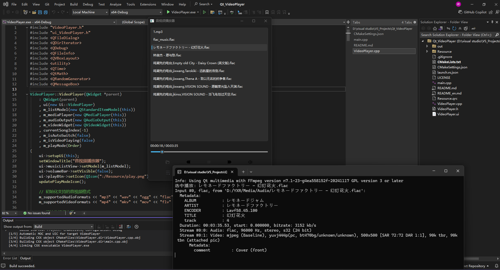

  <a href="README.md">中文</a>

# 🎬 A Simple Audio Video Player Based on Qt 6.10.2

`Qt_VideoPlayer` is a simple audio/video player developed based on Qt 6.10.2 and C++17. It has been successfully ported to the **Visual Studio 2022** development environment while remaining fully compatible with Qt Creator. It aims to provide a clean and user-friendly graphical interface while demonstrating the integration of the Qt framework with multimedia processing libraries. The actual running interface is shown below:

> *Note: This project is primarily for personal learning and sharing design ideas for Qt multimedia development, rather than building a fully-featured daily player that can replace mature products like VLC or PotPlayer.*

Detailed tutorial documentation: https://zhuanlan.zhihu.com/p/1929289732564710634

---

## Features

### Basic Functions

- Feature 1: Implement basic player UI layout and standardized naming.
- Feature 2: Read local folder media files into the player list, double-click to play audio or video, supporting common audio/video formats.
- Feature 3: Automatically detect whether the currently playing media is audio or video. When playing audio, the video playback window is hidden by default; only when playing video is the window displayed and the current media rendered to the window.
- Feature 4: Implement button switching logic, including automatic switching after playback (with optional single loop, sequential play, and random play modes), previous/next track button interaction, and highlighting the current playing item in the list.
- Feature 5: Rich button control logic, including play/pause control, volume adjustment, dragging the progress bar to change playback position, and display of total media duration and current playback progress.
- Feature 6: Custom window close event. When closing a playing video window, the play button, audio, progress bar, and time label are synchronized to pause. Clicking the play button again or double-clicking a video file in the list will re-display the window, ensuring the video window appears synchronously with playback operations.

### Cross-Platform Effects

> *Program running result under VS 2022 platform (here the generated window is black due to the system's default dark theme, no need to mind this).*

Currently, the project supports use in both Qt Creator and VS 2022 with only configuration files added without modifying core code. The entire build system works as follows:

- Qt Creator/VS 2022 as IDE: Provides editing and debugging interface
- CMake as build system: Cross-platform configuration, one CMakeLists.txt for all
- Ninja as build tool: Fast compilation
- MSVC as compiler: Generates Windows executable files
- Qt as framework: Provides GUI and multimedia functions

Dual IDE development advantages:

- UI Design: Qt Creator's visual designer is more convenient
- Deep Debugging: VS 2022's diagnostic tools are more powerful
- Team Collaboration: Supports developers with different IDE preferences to work together

---

## Core Optimizations

To improve code quality, running efficiency, and user experience, the project has undergone three important optimizations:

### Random Number Generation Optimization
- Original method: Used C-style srand/rand to generate random indexes, requiring manual seed setting and not thread-safe.
- Optimized: Uses Qt's QRandomGenerator::global()->bounded(n), no manual initialization needed.
- Improvement: Simplifies random number usage, thread-safe with higher quality random numbers, code more compliant with Qt standards.

### Playback Completion Detection Optimization
- Original method: Used a timer to poll every second checking if playback position approached total duration (currentPos >= totalDur - 1000), with precision errors and CPU waste.
- Optimized: Listens to QMediaPlayer::mediaStatusChanged signal, triggering automatic track switching immediately when status changes to QMediaPlayer::EndOfMedia.
- Improvement: More precise and reliable detection, eliminates polling overhead, cleaner and more elegant code, compliant with Qt standards.

### Error Handling Optimization
- Original method: When playback failed (e.g., file corruption, unsupported format), the program gave no prompt, leaving users unaware of the problem.
- Optimized: Connects errorOccurred signal, pops up error dialog to inform users, outputs error information to console, and automatically plays the next available file.
- Improvement: Significantly enhances user experience, facilitates debugging, and strengthens program robustness.

---

## Visual Studio 2022 Porting Implementation

This project has been successfully ported from Qt Creator to the Visual Studio 2022 development environment, using **CMake** as the build system to achieve seamless cross-IDE development experience.

### 1. Project Structure

The complete project directory structure after porting is as follows:
<pre>
D:\visual studio\VS_Projects\Qt_VideoPlayer\
│
├── .vs/                          # VS 2022 local configuration folder (new)
├── out/                          # CMake output folder (new)
├── Resource/                     # Resource files folder
├── .gitignore                    # Git ignore file configuration
├── CMakeLists.txt                # CMake main configuration file
├── CMakeLists.txt.user           # VS user-specific configuration (new)
├── CMakeSettings.json            # CMake settings configuration (new)
├── launch.vs.json                # VS debugging configuration (new)
├── LICENSE                       # License file
├── main.cpp                      # Program entry
├── README.md                     # Chinese documentation
├── README_en.md                  # English documentation
├── Resource.qrc                  # Qt resource file
├── VideoPlayer.cpp               # Player implementation
├── VideoPlayer.h                 # Player header file
└── VideoPlayer.ui                # Qt UI design file
</pre>

### 2. Core Configuration Files Description

#### .vs/ Folder - Visual Studio Local Configuration
<pre>
.vs/
├── ProjectSettings.json          # Project-level VS settings
├── VSWorkspaceState.json         # Workspace state
└── CMakeWorkspaceSettings.json   # CMake workspace settings
</pre>

- Stores VS 2022 project-specific settings (such as breakpoints, open files, window layout)
- Each developer's local configuration differs and should not be committed to Git (already in .gitignore)

#### out/ Folder - CMake Build Output
<pre>
out/
├── build/
│   └── x64-Debug/                # Debug build directory
│       ├── VideoPlayer.exe       # Executable file
│       ├── CMakeFiles/           # CMake temporary files
│       ├── CMakeCache.txt        # CMake cache
│       └── ...                   # Other build artifacts
└── install/                      # Installation directory
    └── x64-Debug/                # Debug installation files
</pre>
- Stores compiled intermediate files and executable files
- Separates source code and build artifacts, keeps source directory clean, should not be committed to Git (already in .gitignore)

#### CMakeSettings.json - CMake Configuration File

- Tells VS 2022 how to configure CMake
- Specifies Qt installation path, defines build directory structure

#### launch.vs.json - Debug Configuration File

- Configures environment variables for debugging
- Ensures Qt DLLs can be found at runtime

Complete build workflow after porting:
<pre>
1. VS 2022 opens project
   ↓
2. Reads CMakeSettings.json
   ↓
3. CMake configuration phase
   ├── Reads CMakeLists.txt
   ├── Locates Qt path (CMAKE_PREFIX_PATH)
   ├── Detects MSVC compiler
   ├── Finds Qt6 components
   │   ├── Core
   │   ├── Widgets
   │   ├── Multimedia
   │   └── MultimediaWidgets
   └── Generates Ninja build files to out/build/x64-Debug/
   ↓
4. Compilation phase (Ninja)
   ├── Compiles main.cpp
   ├── Compiles VideoPlayer.cpp
   ├── Processes VideoPlayer.ui (uic → ui_VideoPlayer.h)
   ├── Processes Resource.qrc (rcc → qrc_Resource.cpp)
   ├── Processes header files (moc → moc_VideoPlayer.cpp)
   └── Links to generate VideoPlayer.exe
   ↓
5. Run/Debug
   ├── Reads launch.vs.json
   ├── Sets PATH environment variable
   └── Launches VideoPlayer.exe
</pre>

## Contact

Author's blog: https://www.zhihu.com/people/13-73-62-89-19

Email: 2022280099@email.szu.edu.cn

This project will continue to be updated with more new features and UI interactions. Welcome to submit issues sharing suggestions for modifications and improvements!

Thank you for your attention and interest!
