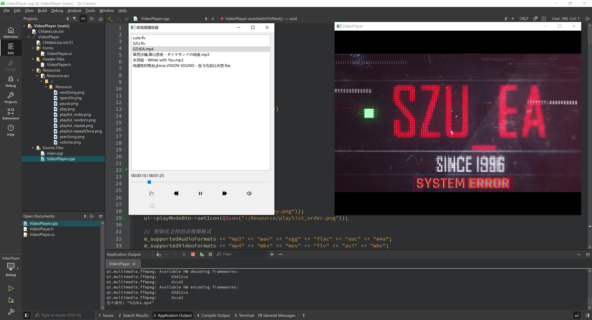

  <a href="README.md">简体中文</a>

## A Simple Audio-Video Player Based on Qt 6.8.2

| 📄 License | 💻 Language | 🖥️ Platform |
|:----------:|:-----------:|:-----------:|
|    MIT     |   C++ 17    |   Windows   |

`Qt_VideoPlayer` is a simple audio-video player developed based on Qt 6.8.2 and C++17, currently running successfully in the Qt Creator environment. It aims to provide a clean and user-friendly graphical interface while demonstrating the integration of the Qt framework with multimedia processing libraries. The actual running interface is as follows:

> *Note: This project is mainly for sharing personal learning experiences in Qt multimedia development, rather than creating a fully functional player that can replace mature products like VLC or PotPlayer for daily use.*

Detailed project introduction and tutorial: https://zhuanlan.zhihu.com/p/1929289732564710634

## Features

- Feature 1: Implements basic player UI layout and standardized naming conventions.
- Feature 2: Reads local folder media files into the player list, supports double-click to play audio or video, and compatible with common media formats playback.
- Feature 3: Automatically identifies whether the current media is audio or video. The video window is hidden by default when playing audio, and only displayed when playing video, rendering the media content in real-time.
- Feature 4: Implements playback mode switching logic, including automatic switch after playback completion (with three modes: single-loop, sequential playback, and random playback), previous/next track buttons, and highlight tracking of current playing item in the list.
- Feature 5: Rich button control logic, including play/pause, volume adjustment, progress bar dragging to change playback position, and display of total media duration and current playback progress.
- Feature 6: Custom window closing event. When closing a playing video window, the play button, audio, progress bar, and time labels will synchronize to pause state. The window will reappear when clicking the play button or double-clicking a video file in the list, ensuring the video window synchronizes with playback operations.

## Planned Features

This project will continue to be improved with more new features and UI interactions. The priority order of planned features is as follows:
- New button interactions: Add three switching modes after automatic playback ends (single track loop, sequential play, shuffle play), switchable via button clicks.
- Variable speed playback: Mainly for video files, supporting 0.5x, 2x speed, etc., with progress bar and time label updating accordingly.

## Contact & Inquiries

Author's blog: https://www.zhihu.com/people/13-73-62-89-19

Email: 2022280099@email.szu.edu.cn

This project will continue to be improved with more new features and UI interactions. Welcome to submit issues with suggestions for modifications and improvements!

Thank you for your attention and support!
